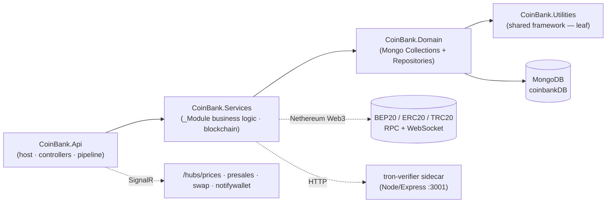
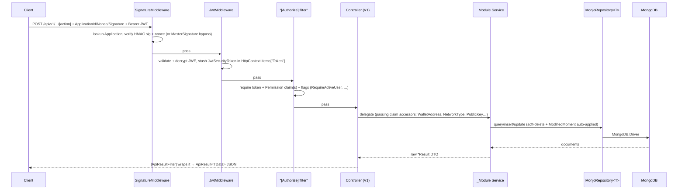

# Architecture

CoinBank API is a single ASP.NET Core (.NET 8) Web API host built as a **classic N-tier
(layered) application on MongoDB** — not microservices, Clean Architecture, DDD, CQRS, or EF.

## Layering & dependency direction

Four projects, strict one-way dependency chain (each layer depends only on the one to its right):



`CoinBank.Utilities` is a copied-in shared framework (largely identical across sibling repos):
the `ApiResult` envelope, `BaseException` + middleware, the **Monjo** MongoDB wrapper, JWT (JWE)
services, the DI marker interfaces, filters, permissions, and Swagger filters. Its code lives
under the prefix-less `Utilities.*` namespace.

## Middleware pipeline (exact order)

From `CoinBank.Api/Program.cs` — order is load-bearing:

```
UseHsts(env) → UseDeveloperExceptionPage(env) → UseSwaggerAndUI() → UseRequestLogger()
→ UseCustomExceptionHandler() → UseJWTBlackList() → UseProductionCors() → UseFirewall()
→ UseSignature() → UseJwt() → UseRouting() → UseCustomRateLimiting() → UseAuthorization()
→ UseEndpoints()
```

Then SignalR hubs are mapped:
`/hubs/prices` (PriceHub), `/hubs/presales` (PreSaleHub), `/hubs/swap` (SwapHub),
`/hubs/notifywallet` (WalletNotifyHub).

Ordering notes:
- `UseCustomExceptionHandler()` sits high (right after request logging) so it catches exceptions
  from all downstream middleware and converts them to an `ApiResult` JSON body.
- `UseSignature()` (request authenticity, HMAC) runs **before** `UseJwt()` (identity) — authenticity
  is checked before the token is even parsed.
- `UseJWTBlackList()` runs **before** `UseJwt()`.
- Two middleware-extension files exist: `CoinBank.Api/Utilities/Middlewares/ApplicationControllerBuilderExtensions.cs`
  (ProductionCors, JWTBlackList, RequestLogger) and `CoinBank.Utilities/Configuration/ApplicationBuilderExtensions.cs`
  (Hsts, Endpoints, CustomExceptionHandler, Firewall, Signature, Jwt, CustomRateLimiting).

## Request lifecycle



On any thrown exception, `CustomExceptionHandlerMiddleware` catches it, maps it to an HTTP
status + `ApiResultStatusCode` (via `BaseException`), serializes an `ApiResult(false, …)`, and
reports to Sentry.

## Monjo data flow

- Entities live in `CoinBank.Domain/Collections/`, extend `BaseDocument`
  (`Id` ObjectId-as-string, `CreatedMoment`/`ModifiedMoment`, `IsDeleted`/`DeletedMoment`), and
  are tagged `[MonjoCollectionName("…")]` (collection name read by reflection).
- `MonjoRepository<TDocument> : IMonjoRepository<TDocument>` (in `Utilities/MongoDatabase/`) is the
  generic base over `MongoDB.Driver` — ~60 methods (FilterBy, Find, Insert/Replace/Update/Upsert,
  Delete (soft), Count, Exists, AsQueryable, Aggregate, paged `FilterByAsync(MonjoQuery)`).
- **Soft-delete is enforced at the repository level**: every read ANDs `!IsDeleted`, every delete
  sets `IsDeleted=true` + `DeletedMoment`, every update auto-stamps `ModifiedMoment`.
  `RealDeleteManyAsync` is the only true delete.
- `MonjoConnection : IMonjoConnection, ISingletonDependency` wraps `MongoClient`/`IMongoDatabase`;
  `MonjoSettings`/`IMonjoSettings` bind from config.

## Three authentication layers

In pipeline order, each independent:

1. **Application signature** (`SignatureMiddleware`) — every non-exempt request sends
   `ApplicationId`, `Nonce`, `Signature` headers. The app is looked up in
   `ApplicationPoolSettings.Applications`; `Signature == MasterSignature` is a nonce-less bypass,
   otherwise the nonce must be unused (replay protection) and HMAC-SHA256 `Verify` must pass.
   Exempt: the 4 `/hubs/*` endpoints and `/api/v1/File/DownloadFile`.
2. **JWT parse** (`JwtMiddleware`) — reads `Authorization: Bearer`, validates+decrypts the **JWE**
   token (signed HMAC-SHA256 + AES-128 encrypted, `ClockSkew = TimeSpan.Zero`), stashes the
   `JwtSecurityToken` in `HttpContext.Items["Token"]`. Does not reject missing tokens.
3. **Authorization** (`Utilities.Filters.AuthorizeAttribute`, the **custom** `[Authorize]`) — per
   action: requires a token; if permission codes are passed, requires matching `Permission`
   claim(s); optional `RequireActiveUser` / wallet-network flags. Public-API users authenticate by
   **wallet signature** (nonce → sign → JWT). Admin-role tokens are rejected here — the public API
   serves wallet customers — except on the permission-gated management endpoints (e.g.
   `[Authorize(Permissions.PreSaleManage)]`).

## Blockchain stack

- **EVM (BEP20/ERC20/TRC20):** **Nethereum 5.0.0** (`Web3`, `Signer`, `Contracts`, reactive
  WebSocket client). `_BlockChain` builds three `Web3` instances (BEP20 carries a signing
  `Account` from `BlockChainSettings.PrivateKey`) and uses embedded ABI constants for
  presale/swap/stake reads and balance queries.
- **Batched reads:** `_MultiCallService` collapses many contract reads into one RPC via the
  Multicall contract.
- **Event listening:** `_BlockChainWebSocket` runs `BackgroundService` listeners
  (`BEP20/ERC20BlockChainEventBackgroundService` WebSocket subscriptions + polling fallbacks) for
  presale/stake/swap contract events.
- **Prices:** `_Price` + `PriceScheduler` (60s) fetch CMC + on-chain pool prices, pushed via
  `PriceHub`.
- **`_PancakeSwap` is currently commented out / inactive** — present but not wired; do not
  document it as live behavior.

### tron-verifier sidecar (Node, not .NET)

Because Nethereum cannot verify **TRON** message signatures, a standalone Node.js/Express
sidecar handles it. `tron-verifier/server.js`: Node 20-alpine, Express 5.2.1, TronWeb 6.2.2,
listening on **port 3001**, exposing **`POST /verify`** `{ message, signature, address }` →
`tronWeb.trx.verifyMessageV2(...)` against `https://api.trongrid.io`, returning
`{ valid, recoveredAddress }`. The .NET app calls it over HTTP via `VerifyTronServiceSettings.BaseUrl`
(`_User/UserService` uses it for TRON wallet logins). Deployed as its own docker-compose service
(`tron.coinbank.com`) with its own `Dockerfile`/`deploy.sh`.

### SignalR hubs

Four hubs (`PriceHub`, `PreSaleHub`, `SwapHub`, `WalletNotifyHub`) push an injected singleton
`*Storage` object to connected clients on connect/update; they are exempt from the signature
middleware and use the JSON protocol with `JsonStringEnumConverter`.

---

## Architecture Assessment

Direct, grounded in the current code. Good things are noted as such.

### What's solid
- **Clean, consistent layering.** The `Api → Services → Domain → Utilities` chain is genuinely
  one-way and the `_<Module>` feature-folder organization makes the business surface easy to navigate.
- **Marker-interface DI** removes registration boilerplate and is applied consistently.
- **Centralized response/error contract.** `ApiResult` + `[ApiResultFilter]` +
  `CustomExceptionHandlerMiddleware` give every endpoint a uniform envelope and a single error path.
- **Defense in depth at the edge:** HMAC request signature + replay-nonce, encrypted (JWE) tokens
  with zero clock skew, firewall, and rate limiting.

### Risks & smells
- **Committed secrets / hard-coded values.** The Sentry DSN is hard-coded in `Program.cs`, and a
  `test` application in `ApplicationPoolSettings` ships with `PreSharedKey = "test"` /
  `MasterSignature = "test"` in `appsettings.json` — a nonce-less signature bypass backdoor. The
  blockchain operator **private key** and other secrets flow through env/`.env`; treat any value in
  source control as compromised. See [SECURITY.md](SECURITY.md). **Recommend:** move all secrets to
  env/secret store, remove the `test` app from committed config, rotate exposed values.
- **`NotFoundException(string)` returns HTTP 500, not 404.** Only the `(ApiResultStatusCode, string)`
  ctor sets 404; the string-only ctor routes through `BaseException(statusCode, message)` and leaves
  the status at `InternalServerError`. Same trap for any subclass using that path. **Recommend:** fix
  the ctor chain so the HTTP status matches the semantic status.
- **Allow-all firewall by default.** The default `FirewallSettings` / docker-compose rules are
  effectively `Allow *`. **Recommend:** ship a restrictive default and allow-list explicitly.
- **Exceptions swallowed in schedulers.** `SchedulerBase.HandleAsync` failures are caught and only
  `Console.WriteLine`d (a legacy `OldSchedulerBase` also lingers). **Recommend:** log to Sentry/structured
  logging and surface scheduler health; delete the dead `OldSchedulerBase`.
- **Dead / inactive code.** `_PancakeSwap` is fully commented out; `OldSchedulerBase` is legacy;
  the `CoinHalls.Api.Controllers.V1` namespace on `FileController.cs` is rename residue. **Recommend:**
  remove dead code and normalize the stray namespace.
- **Verbose error leakage in dev.** Sentry has `SendDefaultPii = true`; in Development the exception
  middleware serializes full stack traces + `AdditionalData` into the response body. **Recommend:**
  keep PII off and ensure dev-only detail never reaches a deployed environment.
- **Partial automated safety net.** A GitLab CI pipeline (`.gitlab-ci.yml`, see [CI.md](CI.md)) now
  gates every MR into `main` on a Release build + a csharpier format check (advisory until a one-time
  reformat commit lands), with built-in Roslyn analyzers surfaced as warnings (`Directory.Build.props`)
  and package versions centralized in `Directory.Packages.props`; deploy to the prod box is a
  manual-gated job on a self-hosted runner. The codebase still mixes file-scoped and block-scoped
  namespace styles, and there is **still no test project** — the highest-value remaining gap.
  **Recommend:** add a smoke/integration test project (money path first), then graduate the format
  check and `TreatWarningsAsErrors` to blocking once the baseline is clean.
- **Copied-in Utilities drift.** `CoinBank.Utilities` is a near-copy of sibling repos' framework with
  small per-repo edits; fixes made here won't propagate. **Recommend:** if these repos share an owner,
  consider extracting the framework into a shared package to stop copy-paste drift.
